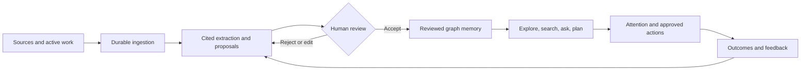
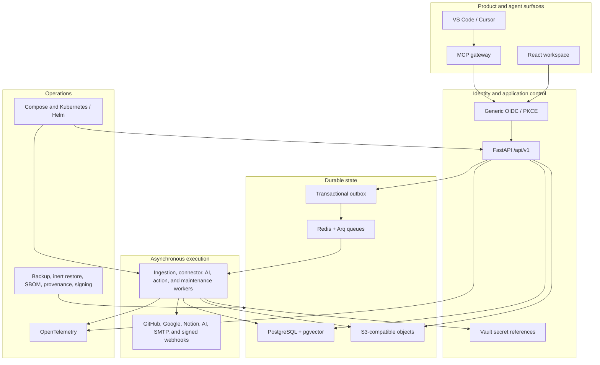

<div align="center">

# Graphview

### Reviewed knowledge. Visible provenance. Durable graph memory.

Graphview turns documents, repositories, connected workspaces, and active agent context into a living knowledge graph
that people can inspect, question, review, and act on without silently promoting generated claims into trusted memory.

[](docs/releases/1.0.0.md)
[](https://github.com/RNT56/grapheracy/actions/workflows/ci.yml)
[](https://github.com/RNT56/grapheracy/actions/workflows/security.yml)
[](https://github.com/RNT56/grapheracy/actions/workflows/staging.yml)
[](services/api/openapi.yaml)
[](#license)

[Why Graphview](#why-graphview) · [Product Loop](#the-product-loop) · [Capabilities](#capabilities) ·
[Quick Start](#quick-start) · [Architecture](#architecture) · [Proof](#measured-proof) · [Documentation](#documentation)

</div>

---

## Why Graphview

Most knowledge systems make one of two compromises: they preserve raw information but leave it hard to navigate, or
they use AI to produce convenient answers while obscuring where those answers came from. Graphview keeps the speed of
AI-assisted synthesis and the discipline of an auditable knowledge system.

| The usual failure | Graphview's answer |
| --- | --- |
| Sources disappear behind generated summaries | Every reviewed graph item retains source, chunk, lineage, and review provenance |
| AI output quietly becomes organizational truth | AI creates cited proposals; reviewer authority commits trusted graph state |
| Large graphs become unreadable hairballs | Server-assisted clustering, level of detail, focused subgraphs, lenses, and saved layouts |
| Connectors run as opaque background magic | Durable jobs, cursors, retries, tombstones, health, activity, and actionable failures |
| Signals, decisions, and actions live in separate tools | Attention connects observations to ownership, decisions, approved actions, outcomes, and feedback |
| Agent context is copied into another ungoverned memory | Capture is scoped, redacted, encrypted, replayable, and review-gated before derivation |

Graphview is designed for internal research, knowledge operations, technical investigation, and personal knowledge
workflows where trust matters as much as retrieval.

## The Product Loop



The graph is not merely a visualization layer. It is the operating surface for evidence, semantic relationships,
review state, activity, agent traversal, attention, decisions, and memory.

## Capabilities

| Surface | What ships in Graphview 1.0 |
| --- | --- |
| **Living graph workspace** | Sigma 3 and Graphology 2D WebGL, lazy Three.js 3D, deterministic layouts, minimap, command palette, semantic search, lenses, filters, path tracing, neighborhood expansion, replay, comparison, export, and accessible fallback |
| **Scale-aware projection** | PostgreSQL-backed viewport and focused-subgraph APIs, progressive cluster expansion, visible GPU budgets, persisted coordinates, and projects up to 100,000 nodes and 500,000 edges |
| **Reviewed knowledge creation** | Source/chunk provenance, proposal ghosting, evidence fan-out, accept/reject/edit transitions, immutable review history, graph versions, and compatibility-safe migration |
| **Continuous ingestion** | Upload, URL, GitHub/repository, Google Workspace, and Notion connectors with Arq workers, transactional outbox dispatch, cursors, schedules, retries, deletion detection, tombstones, and health |
| **Cited AI and planning** | Hybrid text/vector retrieval, cited graph Q&A, scoped research, planning sessions, durable run states, provider budgets, cancellation, retrieval audits, and proposal-only graph writes |
| **Attention and action** | Signals, observations, severity and SLA routing, ownership, decisions, GitHub Issues, SMTP, signed workflow webhooks, callbacks, outcomes, feedback, and review-gated memory proposals |
| **Active agent context** | MCP gateway and VS Code/Cursor extension, scoped capture tokens, ordered offline outbox, resumable SSE, redaction, encrypted S3 retention, purge metadata, and reviewed derivation |
| **Production operations** | Generic OIDC/PKCE, Redis sessions, Vault secret references, MinIO/S3, OpenTelemetry, inert backup/restore, Compose, Helm, SBOMs, vulnerability scans, provenance, and signed release workflows |

## Trust Is a Product Feature

Graphview encodes authority into the system instead of relying on prompt wording or operator memory.

- **AI proposes; reviewers decide.** Generated observations, answers, research, and actions require citations and cannot
  directly create reviewed graph items.
- **Every important transition is durable.** Jobs, outbox events, connector cursors, review decisions, action runs,
  outcomes, feedback, and audit records survive process restarts.
- **Credentials stay behind worker boundaries.** Browser clients receive opaque references; connector, provider, and
  action secrets resolve only at execution time.
- **External side effects are explicit.** GitHub Issues, email, and webhooks require approved action proposals,
  idempotency markers, bounded retries, and recorded receipts.
- **Recovery never replays the world.** Restore removes usable credentials, revokes sessions, suppresses unfinished
  work, and never re-executes completed external actions.
- **Accessibility is not a fallback plan.** Keyboard navigation, high contrast, reduced motion, focus visibility,
  screen-reader list/table equivalents, responsive layouts, and non-WebGL operation are first-class contracts.

Read the full [security model](docs/03-security.md) and [security policy](SECURITY.md).

## Quick Start

### Requirements

- Node.js 24
- pnpm 10.27+
- Python 3.14
- [uv](https://docs.astral.sh/uv/)
- Docker for production-reference services

### Install and verify

```sh
pnpm install --frozen-lockfile
uv sync --all-packages --frozen
pnpm run quality:fast
```

### Start the development surfaces

Run each command in its own terminal:

```sh
# API
pnpm --filter @graphview/api-contract dev

# Worker
pnpm --filter @graphview/worker-contract dev

# Web workspace
pnpm --filter @graphview/web dev
```

SQLite and authenticated local AEAD storage are deliberately limited development adapters. PostgreSQL/pgvector,
Redis/Arq, S3-compatible storage, OIDC, and Vault are the production reference. Follow the
[operations guide](docs/06-operations.md) for Compose, Kubernetes/Helm, backup, restore, observability, and release
procedures.

## Architecture



The backend is split into identity, projects, graph, sources and ingestion, connectors, review and provenance, AI and
planning, Attention and actions, agent context, and operations modules. Routers authenticate and validate; application
services own transitions; repositories own persistence; a shared unit of work and transactional outbox preserve
cross-module consistency.

The web application uses React Router for workspace URLs, TanStack Query for server state, Zustand for ephemeral graph
interaction state, Graphology as the browser graph model, Sigma for primary rendering, and a shared renderer contract
for lazy Three.js parity.

See [Architecture](docs/02-architecture.md), [Data schema](docs/09-data-schema.md), and the generated
[OpenAPI contract](services/api/openapi.yaml).

## Measured Proof

Graphview's release claims are tied to executable acceptance rather than roadmap completion labels.

| Acceptance surface | Current proof |
| --- | --- |
| Graph storage target | 100,000 nodes and 500,000 edges |
| Immutable-runner API p95 | 169.3 ms overview, 36.8 ms detail, 21.2 ms subgraph, 12.1 ms hybrid search |
| Browser rendering | Clustered overview under 2.5 s; 5k/20k at 50-60 FPS target; 20k/50k at 30+ FPS target |
| API and worker contracts | 148 API tests and 8 worker tests, plus package, browser, live-stack, and failure-injection suites |
| Kubernetes reference | 39 validated resources on Kubernetes 1.35 with migration, authenticated ingestion, and no-op upgrade proof |
| Release images | Eight non-root images with SBOM, fixed HIGH/CRITICAL scan gates, provenance, exact digest promotion, and signatures |
| Recovery | PostgreSQL and object-store restore with credential neutralization and side-effect suppression |

Hardware, dataset, query, renderer, and receipt details live in the
[Graphview 1.0 proof ledger](docs/14-graphview-1.0-upgrade-ledger.md).

## Release Status

The integration branch is the Graphview 1.0 release candidate. Repository-controlled quality, security, migration,
browser, image, Compose, and Kubernetes acceptance are enforced by protected checks. The final real-provider canary
uses dedicated GitHub, Google Drive, Notion, OpenAI, SMTP, and HTTPS webhook fixtures; until those disposable fixtures
are provisioned and pass, the candidate remains intentionally unmergeable.

This distinction is deliberate: deterministic tests prove implementation behavior, while the protected canary proves
that the advertised external systems accept real requests from the exact staging-tested images.

See the [release notes](docs/releases/1.0.0.md), [release checklist](docs/rituals/release-checklist.md), and
[current proof ledger](docs/14-graphview-1.0-upgrade-ledger.md).

## Stable Commands

| Command | Purpose |
| --- | --- |
| `pnpm run quality:fast` | Lint, architecture, security policy, contracts, types, tests, canary tooling, release structure, and production web build |
| `pnpm run quality:full` | Fast gate plus smoke, integration, browser, and performance suites |
| `pnpm run security:full` | Policy, licenses, dependency audit, OSV, secret scan, and package integrity |
| `pnpm run test:integration` | API, worker, gateway, and extension integration contracts |
| `pnpm run test:e2e` | Browser acceptance |
| `pnpm run test:performance` | Renderer and projection performance contracts |
| `pnpm run test:deployment` | Helm lint, Kubernetes schema validation, and manifest security |
| `pnpm run release:verify` | Full local quality, security, deployment, packaging, and release artifact verification |
| `pnpm run canary:status` | Names-only external-fixture and exact-staging readiness report |
| `pnpm run canary:dispatch` | Fail-closed protected real-provider canary dispatch |

The complete live-stack matrix is documented in [Testing](docs/05-testing.md).

## Repository Map

| Path | Responsibility |
| --- | --- |
| `apps/web` | React graph workspace and browser acceptance |
| `apps/docs-app` | Documentation route and contract validation |
| `apps/vscode-extension` | VS Code/Cursor active-context adapter |
| `services/api` | FastAPI modules, migrations, persistence, identity, and OpenAPI source of truth |
| `services/worker` | Arq worker functions and durable execution |
| `services/agent-gateway` | MCP-compatible local context gateway |
| `packages/api-client` | Generated TypeScript client |
| `packages/shared-types` | Public, domain, event, and renderer-neutral contracts |
| `packages/graph-core` | Graphology/Sigma planning and graph semantics |
| `packages/design-system` | Accessible tokens and product primitives |
| `infra` | Images, Compose, Helm, Keycloak, telemetry, backup, and restore |
| `docs` | Product, architecture, operations, testing, and executable evidence |
| `prototypes` | Preserved UX evidence excluded from production imports |

## Documentation

| Start here | Build and operate | Product and evidence |
| --- | --- | --- |
| [Documentation guide](docs/00-start-here.md) | [Development](docs/04-development.md) | [Product goals](docs/01-product-goals.md) |
| [Architecture](docs/02-architecture.md) | [Testing](docs/05-testing.md) | [User journeys and value map](docs/10-user-journeys-and-value-map.md) |
| [Security](docs/03-security.md) | [Operations and release](docs/06-operations.md) | [Graphview 1.0 proof ledger](docs/14-graphview-1.0-upgrade-ledger.md) |
| [Data schema](docs/09-data-schema.md) | [Agent workflows](docs/07-agent-workflows.md) | [Release notes](docs/releases/1.0.0.md) |
| [Security policy](SECURITY.md) | [Maintainer guide](CLAUDE.md) | [Changelog](CHANGELOG.md) |

The [historical roadmap](docs/08-roadmap.md) and phase/vision documents remain available as implementation context.
They are not substitutes for the current proof ledger.

## Preserved Prototype

The original single-file experience remains at
[`prototypes/knowledge-graph-explorer.html`](prototypes/knowledge-graph-explorer.html) as design and interaction
evidence. Production code does not import demo fixtures or prototype modules.

## License

Graphview is currently proprietary and `UNLICENSED`. The public repository does not grant an open-source license or
permission to reuse, redistribute, or publish the software. A separate licensing decision is required before external
distribution.

---

<div align="center">

**Graphview makes knowledge useful without making trust invisible.**

[Documentation](docs/00-start-here.md) · [Architecture](docs/02-architecture.md) ·
[Security](docs/03-security.md) · [Operations](docs/06-operations.md) ·
[Proof ledger](docs/14-graphview-1.0-upgrade-ledger.md)

</div>
