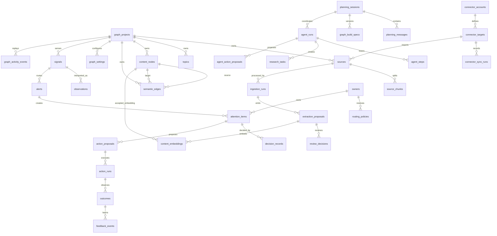

# Data Schema

## Purpose

Define the canonical Graphview data schema for sources, chunks, proposals, reviewed content, connector sync, and AI
planning records. This document is the human-readable schema reference; the executable contracts remain in code.

## Sources Of Truth

Use these in order when schema behavior differs:

1. Runtime persistence model: `../services/api/src/graphview_api/db.py`.
2. Alembic migrations: `../services/api/migrations/versions`.
3. API request and response models: `../services/api/src/graphview_api/schemas.py`.
4. Generated OpenAPI contract: `../services/api/openapi.yaml`.
5. Frontend/shared public TypeScript contracts: `../packages/shared-types/src/index.ts`.
6. Worker stage contract: `../services/worker/worker-contract.md`.

The OpenAPI file is generated from the running FastAPI app. Do not hand-edit endpoint schemas there unless the generated
contract cannot represent the intended API shape.

## Entity Map



## Vocabulary

Source kinds are: `text`, `markdown`, `url`, `pdf`, `repository`, `ops-document`.

Connector kinds are: `upload`, `url`, `repository`, `google-workspace`, `notion`.

Graph lenses are: `all`, `research`, `engineering`, `ops`.

Digital nervous system signal kinds are: `source_changed`, `source_stale`, `proposal_ready`, `proposal_blocked`,
`conflict_detected`, `anomaly_detected`, `connector_issue`, `agent_action_pending`, `decision_due`, `outcome_due`, and
`policy_violation`.

Digital nervous system action proposal statuses are: `proposed`, `pending_review`, `approved`, `rejected`, `queued`,
`running`, `succeeded`, `failed`, and `cancelled`.

Proposal kinds are: `content_node`, `semantic_edge`.

Proposal statuses are: `pending_review`, `accepted`, `rejected`, `edited`, `deferred`.

Review decisions are: `accept`, `reject`, `edit`, `defer`.

Semantic relations are: `supports`, `contradicts`, `depends_on`, `causes`, `mentions`, `defines`, `relates_to`,
`contains`, `part_of`, `references`, `imports`, `implements`, `owned_by`, `has_review_cycle`, `governs`.

Content node kinds are defined in `CONTENT_NODE_KINDS` in `schemas.py` and mirrored by `ContentNodeKind` in
`packages/shared-types/src/index.ts`. New kinds must be added to both and covered by tests.

## Core Tables

| Table | Purpose | Key columns | JSON columns |
| --- | --- | --- | --- |
| `graph_projects` | Workspace-level graph container. | `id`, `name`, `created_at`, `updated_at` | None |
| `topics` | Imported or curated graph topic hierarchy. | `id`, `project_id`, `parent_topic_id`, `name` | None |
| `graph_settings` | Project extraction, LLM, and auto-commit settings. | `project_id`, `llm_enabled`, `llm_provider`, `llm_model`, `auto_commit_threshold` | `settings_json` |
| `sources` | User-created, fetched, or connector-imported source artifacts. | `id`, `project_id`, `kind`, `title`, `uri`, `object_key`, `checksum`, `connector_kind`, `remote_id`, `remote_parent_id`, `remote_modified_at`, `remote_url`, `stale_at` | `metadata_json` |
| `source_chunks` | Normalized source blocks for provenance and context retrieval. | `id`, `project_id`, `source_id`, `parent_chunk_id`, `block_type`, `ordinal`, `text`, `checksum`, `locator` | `heading_path_json`, `links_json`, `mentions_json` |
| `ingestion_runs` | Traceable source processing runs. | `id`, `project_id`, `source_id`, `status`, `stage`, `trace_id`, `started_at`, `finished_at`, `error_code` | None |
| `extraction_proposals` | Reviewable candidate nodes and relationships. | `id`, `project_id`, `ingestion_run_id`, `kind`, `status`, `confidence`, `created_at` | `proposed_value_json`, `provenance_json` |
| `review_decisions` | Human or system review decisions. | `id`, `project_id`, `proposal_id`, `reviewer_id`, `decision`, `rationale`, `decided_at` | `edited_value_json` |
| `content_nodes` | Accepted graph nodes. | `id`, `project_id`, `label`, `kind`, `summary`, `created_at`, `updated_at` | `topic_ids_json`, `metadata_json`, `provenance_json` |
| `semantic_edges` | Accepted graph relationships. | `id`, `project_id`, `source_node_id`, `target_node_id`, `relation`, `weight`, `created_at`, `updated_at` | `metadata_json`, `provenance_json` |
| `content_embeddings` | Deterministic or provider-generated vectors. | `id`, `project_id`, `proposal_id`, `content_node_id`, `embedding_model`, `created_at` | `vector_json` |

## Connector Tables

| Table | Purpose | Key columns | JSON columns |
| --- | --- | --- | --- |
| `connector_accounts` | Redacted connector account configuration. | `id`, `project_id`, `kind`, `display_name`, `status`, `created_by` | `encrypted_token_json`, `scopes_json`, `settings_json` |
| `connector_targets` | Remote folder, page, repository, URL, or upload target. | `id`, `project_id`, `account_id`, `connector_kind`, `target_type`, `remote_id`, `title`, `parent_remote_id`, `last_synced_at` | `sync_settings_json` |
| `connector_sync_runs` | Manual sync execution records. | `id`, `project_id`, `target_id`, `status`, `stage`, counts, `trace_id`, `started_at`, `finished_at` | None |

Connector tokens must never be returned by read endpoints. `connector_accounts` responses expose `scopes` and `settings`
only.

## Agent And Planning Tables

| Table | Purpose | Key columns | JSON columns |
| --- | --- | --- | --- |
| `planning_sessions` | AI-assisted graph planning sessions. | `id`, `project_id`, `graph_id`, `lens`, `title`, `goal`, `status`, `provider`, `model`, `created_by` | `metadata_json` |
| `planning_messages` | User, assistant, and system messages in a planning session. | `id`, `project_id`, `session_id`, `agent_run_id`, `role`, `content`, `provider`, `model` | `metadata_json` |
| `graph_build_specs` | Versioned draft/approved graph build specs. | `id`, `project_id`, `session_id`, `version`, `title`, `objective`, `status` | `spec_json` |
| `agent_runs` | Provider-bound AI workflow executions. | `id`, `project_id`, `planning_session_id`, `kind`, `status`, `provider`, `model`, `trace_id`, `created_by`, timestamps | `input_json`, `output_json` |
| `agent_steps` | Step-level agent trace records. | `id`, `project_id`, `agent_run_id`, `name`, `status`, summaries, `trace_id`, timestamps | `metadata_json` |
| `research_tasks` | Idempotent graph research tasks. | `id`, `project_id`, `agent_run_id`, `planning_session_id`, `query`, `status`, `provider`, `model`, `source_policy`, `idempotency_key` | `result_json` |
| `agent_action_proposals` | Review-gated AI action proposals. | `id`, `project_id`, `agent_run_id`, `action_type`, `status`, `title`, `summary`, `confidence`, timestamps | `payload_json`, `citations_json` |

Agent records are included in backup and restore. Agent-created graph mutations must still flow through proposals and
review decisions.

## Digital Nervous System Tables

| Table | Purpose | Key columns | JSON columns |
| --- | --- | --- | --- |
| `signals` | Sensed changes, anomalies, connector issues, due work, and manual Attention inputs. | `id`, `project_id`, `graph_id`, `kind`, `status`, `severity`, `source_kind`, `source_id`, `checksum`, `trace_id`, `actor_id`, timestamps | `payload_json` |
| `observations` | Interpreted evidence linked to a signal or graph/source object. | `id`, `project_id`, `signal_id`, `kind`, `summary`, `confidence`, `created_at` | `evidence_json`, `object_refs_json`, `source_ids_json`, `node_ids_json`, `edge_ids_json`, `metadata_json` |
| `owners` | Person/team/service ownership for projects, sources, connectors, policies, actions, and graph objects. | `id`, `project_id`, `owner_type`, `display_name`, `contact`, `scope_kind`, `scope_id`, timestamps | `metadata_json` |
| `routing_policies` | Rules that turn signals into alerts and Attention items with severity, owner, SLA, and suggested actions. | `id`, `project_id`, `name`, `enabled`, `severity`, `owner_id`, `sla_seconds`, `approval_required`, timestamps | `match_json`, `suggested_actions_json`, `metadata_json` |
| `alerts` | Routed issues that may be assigned, blocked, resolved, or dismissed. | `id`, `project_id`, `signal_id`, `observation_id`, `owner_id`, `policy_id`, `severity`, `status`, `title`, `due_at`, timestamps | `object_refs_json` |
| `attention_items` | Human-facing work items for proposal review, stale knowledge, connector issues, action follow-up, and outcomes. | `id`, `project_id`, `kind`, `status`, `severity`, `sla_status`, `owner_id`, `due_at`, linked record IDs, timestamps | `object_refs_json`, `evidence_json`, `suggested_actions_json`, `blockers_json` |
| `decision_records` | Durable human or policy decisions on alerts, Attention items, or proposals. | `id`, `project_id`, `alert_id`, `attention_item_id`, `proposal_id`, `decision`, `actor_id`, `created_at` | `evidence_json`, `object_refs_json` |
| `action_proposals` | Review-gated operational actions with redacted response payloads and safety metadata. | `id`, `project_id`, linked record IDs, `action_type`, `status`, `approval_required`, actors, timestamps | `payload_json`, `redacted_payload_json`, `safety_json` |
| `action_runs` | Executions of approved safe actions. | `id`, `project_id`, `action_proposal_id`, `action_type`, `status`, `executor_id`, `target`, `trace_id`, timestamps | `payload_json`, `redacted_payload_json` |
| `outcomes` | Observed results for action runs, alerts, or Attention items. | `id`, `project_id`, `action_run_id`, `attention_item_id`, `alert_id`, `status`, `actor_id`, timestamps | `result_json` |
| `feedback_events` | Learning records that adjust confidence, freshness, priority, policy suggestions, or graph-memory proposals. | `id`, `project_id`, linked record IDs, `kind`, `summary`, `actor_id`, `created_at` | `effect_json`, `proposed_value_json` |
| `graph_activity_events` | Replayable activity stream for graph and nervous-system visualization. | `id`, `project_id`, `event_type`, `actor_id`, `summary`, `created_at` | `object_refs_json`, `payload_json`, `lenses_json` |

Action proposal and run responses expose `redacted_payload` only. Backup/export also uses redacted action payloads for
restored `payload_json` so restoring a bundle preserves the audit trail without rehydrating sensitive raw action inputs
or replaying side effects.

## Proposal Values

`content_node` proposal values must include:

```json
{
  "id": "node_optional_stable_id",
  "label": "Required display label",
  "kind": "concept",
  "summary": "Optional summary",
  "topicIds": [],
  "metadata": {}
}
```

`semantic_edge` proposal values must include:

```json
{
  "id": "edge_optional_stable_id",
  "sourceNodeId": "node_source",
  "targetNodeId": "node_target",
  "relation": "relates_to",
  "weight": 0.72,
  "metadata": {}
}
```

Generated edge proposals can use labels during extraction, but repository persistence resolves them to node IDs before
storage. Manually-created edge proposals must include node IDs.

## Provenance

Committed graph items and proposals carry provenance entries with these core fields:

```json
{
  "sourceId": "src_...",
  "sourceUri": "https://example.invalid/source",
  "locator": "source#block-1",
  "extractedBy": "worker",
  "actorId": "user-researcher",
  "ingestionRunId": "run_...",
  "observedAt": "2026-06-05T10:00:00+00:00",
  "traceId": "trace_..."
}
```

Connector provenance can add `connectorKind`, `remoteId`, or related fields. Pydantic allows those extras, but the core
fields above must remain stable.

## Invariants

- A source belongs to exactly one project.
- Connector source identity is unique by `project_id`, `connector_kind`, and `remote_id`.
- Source chunk ordinal is unique within a source.
- A committed semantic edge requires both endpoint nodes to already exist.
- Committed edge triplets are unique by `project_id`, `source_node_id`, `target_node_id`, and `relation`.
- A proposal remains the review source of truth; accepted or edited proposals create graph items, rejected and deferred
  proposals do not.
- Every proposal and committed graph item must carry provenance.
- Embeddings are unique by `proposal_id` and `embedding_model`.
- Graph build spec versions are unique within a planning session.
- Research task idempotency keys are unique within a project.
- Backup and restore must preserve original IDs, timestamps, provenance, proposals, decisions, connector records, source
  chunks, graph settings, planning records, agent records, digital nervous system records, and graph activity events.
- Phase 25 action runs require an approved proposal and an action type on the configured safe execution allowlist.
- Source freshness action runs can only mutate a source in the proposal project; missing targets produce failed runs.
- Restoring Phase 25 action proposals and runs must not execute side effects.

## Change Procedure

For every schema change:

1. Update `db.py`.
2. Add an Alembic migration.
3. Update `schemas.py` and shared TypeScript types when the public contract changes.
4. Regenerate `services/api/openapi.yaml` from the FastAPI app.
5. Update this document.
6. Add or update tests for persistence, API validation, backup/restore, and frontend/shared type expectations.

Run at least:

```sh
pnpm --filter @graphview/api-contract test
pnpm --filter @graphview/shared-types test
```
