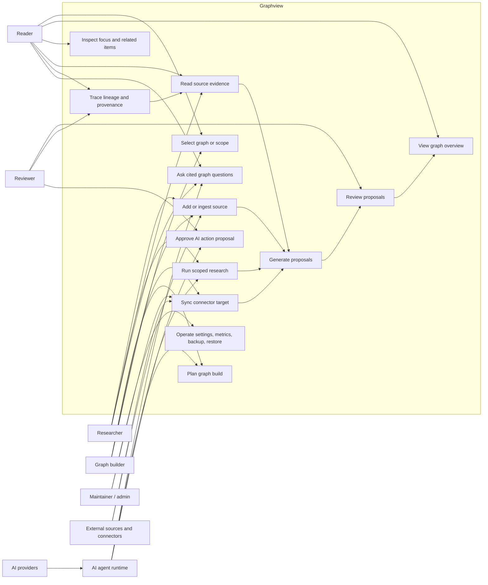

# User Journeys And Value Map

## Purpose

This document maps Graphview from a user's point of view: who uses it, what they are trying to achieve, the full
journeys through the product, where value is created, and which wants and needs the product must protect.

Graphview is an internal AI-native knowledge graph workbench. Users ingest mixed sources, let deterministic and
provider-backed agents propose graph structure, review those proposals before they become durable knowledge, and explore
the reviewed graph with citations and provenance.

## Source Basis

This map is based on the current repository documentation and product code:

- Product goals: `01-product-goals.md`
- Architecture and API boundaries: `02-architecture.md`
- Operations and role behavior: `06-operations.md`
- Data model: `09-data-schema.md`
- Worker contract: `../services/worker/worker-contract.md`
- Web workspace implementation: `../apps/web/src/App.tsx` and `../apps/web/src/GraphCanvas.tsx`
- API implementation: `../services/api/src/graphview_api/main.py` and `../services/api/src/graphview_api/auth.py`

## Product Promise

Graphview turns scattered knowledge into a trusted graph that users can inspect, question, extend, and plan against.
The core promise is not only graph visualization or AI summarization. The core promise is reviewed, cited, durable
knowledge.

The product value concentrates in this trust loop:

```text
source -> chunk -> proposal -> review decision -> graph item -> lineage/citation -> AI answer or research plan
```

Every important user journey should either add useful material to this loop, improve the user's confidence in it, or
help the user act on it.

## User Segments

| User | Primary goal | Core wants | Core needs |
| --- | --- | --- | --- |
| Reader | Understand what the reviewed graph knows. | Search, inspect, ask questions, follow citations. | Fast graph views, readable evidence, citation-backed answers. |
| Researcher | Build and extend knowledge from source material. | Ingest sources, run scoped research, create proposals. | Idempotent ingestion, source chunks, provenance, reviewable outputs. |
| Reviewer | Decide what becomes trusted graph knowledge. | Prioritized work, clear evidence, safe accept/reject/edit actions. | Ready/blocked state, source context, audit trail, endpoint guards. |
| Graph builder | Shape a graph around a research, engineering, or ops domain. | Lenses, connectors, graph planning, source hierarchy. | Stable schemas, graph build specs, domain-aware node and edge types. |
| Maintainer | Operate Graphview inside internal infrastructure. | Configure providers, manage connectors, back up and restore data. | Role controls, metrics, secret safety, backup/restore, release gates. |
| AI agent runtime | Assist without bypassing trust boundaries. | Query graph, plan, research, propose actions. | Tool contracts, citations, provider/model audit, review gates. |

## Role And Permission Model

Graphview currently uses a local seeded-user role model as the testable shape for internal SSO.

| Role | Local user | Can do |
| --- | --- | --- |
| Reader | `reader` | Read graph data, sources, search, insights, lineage, planning sessions, provider descriptors, readiness. |
| Reviewer | `researcher` | Reader actions plus source creation, ingestion runs, proposals, planning messages, research, and review decisions. |
| Admin | `maintainer` | Reviewer actions plus operator actions such as connector setup, settings, metrics, backup, restore, import, export, and source deletion. |

The main product implication is that read, write, review, and operate actions are separate value boundaries. User-facing
flows should make those boundaries visible instead of hiding them behind generic controls.

## User-Facing Surfaces

| Surface | User job | Main value |
| --- | --- | --- |
| Graph picker | Select the active graph or scope. | Keeps work anchored to the right graph context. |
| Graph stage | Explore reviewed nodes and relationships. | Makes the knowledge structure visible and navigable. |
| Outline | Browse and search sources. | Gives users source-first entry into the graph. |
| Lens controls | Switch `all`, `research`, `engineering`, and `ops` graph views. | Keeps domain-specific work focused. |
| Layout dock | Switch Overview, Focus, Evidence, Review, Force, Radial, Arc, 2D, 3D, Sources, Fit, and search. | Lets users move between overview, detailed inspection, and graph readability. |
| Context pane | Inspect selected graph items, evidence, related nodes, and review work. | Turns graph clicks into useful context. |
| Source reader | Read source blocks with locators, links, mentions, and passage actions. | Makes evidence inspectable and actionable. |
| Needs attention | Review proposal work and trust metrics. | Tells reviewers what needs a decision. |
| Graph AI | Ask cited questions or run scoped research. | Speeds up synthesis and graph extension while keeping provenance. |
| Citation drawer | Inspect AI citations and action proposals. | Keeps AI output auditable. |
| Ingest drawer | Add pasted documents or connect source systems. | Starts graph building from user-owned material. |
| Planning Mode | Create graph build specs and research tasks through chat. | Turns vague goals into structured graph work. |
| Operations endpoints | Metrics, backup, restore, provider and connector settings. | Supports internal governance and reliability. |

## Full User Journeys

### Journey 1: Build A Graph From Direct Sources

Goal: A researcher wants to turn pasted or uploaded material into reviewable graph structure.

1. The user opens the graph workspace and confirms the active graph in the graph picker.
2. The user opens the ingest drawer.
3. The user chooses a source kind: text, markdown, URL, PDF text, repository, or ops document.
4. The user enters a source title and source text, or imports a local markdown/text/JSON file.
5. Graphview creates or ingests the source.
6. The ingestion path normalizes content, computes a checksum, creates source chunks, runs extraction lenses, embeds the
   content, and creates proposals.
7. The graph workspace refreshes sources, proposals, review queue, source coverage, insights, neighborhoods, and paths.
8. The user opens Needs attention to review the proposed graph changes.

Success outcome: The source is represented as traceable source records, chunks, ingestion runs, embeddings, and
reviewable proposals.

Value point: The user gets structured graph candidates without giving up human control of what becomes trusted
knowledge.

### Journey 2: Build A Graph From Connectors

Goal: A graph builder or maintainer wants to sync reusable source systems into Graphview.

1. The user opens the ingest drawer and switches to Connect sources.
2. The user selects Upload, URL, Repository, Google Workspace, or Notion.
3. The user configures target title, remote ID or URL, connector content or read target, and optional LLM extraction.
4. The user saves graph settings when needed.
5. The user starts a connector sync or resync.
6. Graphview stores a redacted connector account, target, sync run, imported sources, chunks, proposals, and provenance.
7. The system auto-commits only eligible high-confidence proposals through system review decisions; other proposals stay
   pending.
8. The user reviews sync status, source coverage, pending proposals, and graph changes.

Success outcome: External or semi-external knowledge becomes normal Graphview sources and proposals.

Value point: Connectors increase graph coverage while preserving the same review, provenance, and idempotency model as
direct ingestion.

### Journey 3: Review Proposed Knowledge

Goal: A reviewer wants to decide which proposals should become durable graph items.

1. The reviewer opens the Review or Needs attention surface.
2. The reviewer checks trust metrics: provenance coverage, ready count, blocked count, acceptance rate, and pending edge
   proposals.
3. The reviewer opens a work item and reads the change summary, evidence, citations, affected graph IDs, and source
   context.
4. If the proposal is ready, the reviewer accepts, rejects, or edits it.
5. If a relationship proposal is blocked, the reviewer sees which endpoint nodes are missing and resolves endpoint
   review first.
6. Accepted or edited node proposals create reviewed content nodes.
7. Accepted or edited relationship proposals create semantic edges only when both endpoint nodes exist.
8. The review activity feed records reviewer, decision, timestamp, proposal, and source context.

Success outcome: The reviewed graph changes in a controlled, auditable way.

Value point: Reviewers can trust the graph because every mutation passes through explicit proposal and decision records.

### Journey 4: Explore And Understand The Graph

Goal: A reader or researcher wants to understand a topic, dependency, decision, or relationship.

1. The user selects a graph or scope.
2. The user chooses a graph lens: all, research, engineering, or ops.
3. The user uses Overview for the full graph, Focus for a selected item, Evidence for source-backed context, or Review
   for pending trust work.
4. The user searches the graph or source outline.
5. The user switches layouts between Force, Radial, Arc, 2D, and 3D depending on readability.
6. The user selects a node.
7. The context pane shows summary, source context, evidence blocks, and related graph items.
8. The user opens source content, neighborhood, path, or lineage context to understand why the graph looks the way it
   does.

Success outcome: The user can move from graph overview to evidence-backed detail without leaving the workspace.

Value point: Exploration is not just visual browsing; it is a path from graph structure back to cited source material.

### Journey 5: Read Evidence And Act On A Passage

Goal: A user wants to inspect the source material behind graph knowledge and turn important passages into graph work.

1. The user selects a source from the outline or a graph node with provenance.
2. The context pane shows evidence blocks for the selected source or focus item.
3. The user opens the full source reader.
4. The user navigates source blocks by outline and locators.
5. The user can copy, export, or share the source content.
6. The user can ask about a passage, research around a passage, or create a graph proposal from that passage.
7. Any created proposal goes to review rather than becoming trusted knowledge immediately.

Success outcome: Source reading becomes part of the graph-building workflow instead of a separate document task.

Value point: Evidence remains first-class, which protects trust and makes graph growth explainable.

### Journey 6: Ask A Cited Question

Goal: A reader wants a fast answer grounded in reviewed graph data.

1. The user selects the active graph, lens, node, or source scope.
2. The user asks Graph AI a question.
3. Graphview retrieves reviewed graph context, source context, chunks, lineage, neighborhoods, or paths.
4. The provider generates an answer using supplied Graphview context only.
5. Graphview returns an answer, confidence, citations, provider, model, trace ID, and agent run record.
6. The user opens the citation drawer to inspect source references.

Success outcome: The user gets a useful answer without creating graph mutations.

Value point: Graph Q&A is faster than manual synthesis but still auditable because answers are citation-backed and
read-only.

### Journey 7: Extend The Graph With Scoped AI Research

Goal: A researcher wants the system to find missing evidence or relationships for the active graph.

1. The user enters a research question from Graph AI, Focus, Evidence, or Planning Mode.
2. Graphview creates an agent run and research task with provider, model, trace ID, graph ID, lens, and source policy.
3. The provider returns a concise research note.
4. Graphview ingests that note as a normal markdown source.
5. Graphview creates chunks, embeddings, proposals, and action proposals.
6. The agent run waits for review when proposals or side effects are present.
7. The reviewer opens citations and action proposals, then approves or reviews the resulting work through existing
   review paths.

Success outcome: AI can expand the graph, but durable graph changes still pass through review.

Value point: The product gains AI leverage without breaking the trust model.

### Journey 8: Plan A Graph Build

Goal: A graph builder wants to turn an ambiguous research objective into a structured graph-building plan.

1. The user switches from Graph workspace to Planning Mode.
2. The user writes or edits a planning goal.
3. The user creates a planning session.
4. The user sends planning messages to the agent.
5. The agent returns assistant messages and a graph build spec.
6. The preview sidecar shows topics, open questions, research tasks, provider status, and plan lifecycle.
7. The user launches research tasks from the plan.
8. Research results return to the graph workspace as sources, proposals, citations, and review-gated action proposals.

Success outcome: Planning produces concrete research tasks and graph build specs without mutating the graph by itself.

Value point: Planning Mode helps users decide what graph to build before they spend time ingesting or reviewing.

### Journey 9: Operate And Govern Graphview

Goal: A maintainer wants Graphview to remain safe, recoverable, and internally deployable.

1. The maintainer checks health, readiness, metrics, and trace IDs.
2. The maintainer configures graph settings, provider defaults, LLM extraction, and auto-commit threshold.
3. The maintainer manages connector accounts, targets, and sync runs.
4. The maintainer captures backups before releases or risky operations.
5. The maintainer restores from backup only when needed and with awareness that restore replaces active project state.
6. The maintainer runs release, docs, security, license, typecheck, test, and audit gates.

Success outcome: Graphview can run inside internal infrastructure without exposing secrets or losing graph state.

Value point: Operational controls make the product credible for private, provenance-sensitive knowledge work.

## Use Case Diagram



## Journey-To-Value Map

| Journey | User value | Product capabilities that create value |
| --- | --- | --- |
| Direct source ingestion | Faster conversion from raw material to graph candidates. | Source records, ingestion runs, deterministic extraction, embeddings, proposals. |
| Connector ingestion | Reusable graph building from existing systems. | Connector accounts, targets, sync runs, chunks, source origin metadata, idempotency. |
| Proposal review | Human control over trusted knowledge. | Review queue, decisions, ready/blocked state, endpoint guards, activity feed. |
| Graph exploration | Relationship understanding and navigation. | Graph stage, lenses, search, layout modes, focus context, related items. |
| Evidence reading | Confidence in graph facts. | Source reader, source chunks, locators, links, mentions, copy/export/share. |
| Cited Q&A | Fast synthesis without opaque claims. | Graph query context, citations, provider/model records, read-only agent run. |
| Scoped research | AI-assisted graph extension. | Research tasks, imported AI research sources, proposals, action proposals, review gates. |
| Planning | Turning vague goals into executable graph work. | Planning sessions, messages, graph build specs, topics, open questions, research tasks. |
| Operations | Reliability and governance. | Roles, provider catalog, metrics, backup, restore, import/export, security policy. |

## Wants And Needs Map

| User want | Underlying need | Product response | Risk if missing |
| --- | --- | --- | --- |
| "Show me what we know." | A readable current graph. | Overview, graph lenses, source outline, graph search. | Users treat the graph as decorative or stale. |
| "Show me why this is true." | Source-backed trust. | Lineage, provenance, source chunks, citations. | Users cannot audit graph items or AI answers. |
| "Help me decide what to review." | Prioritization. | Needs attention, review queue, source coverage, dashboard. | Reviewers waste time on low-value or blocked work. |
| "Do not let AI silently change knowledge." | Governance. | Review-gated proposals and action approvals. | AI output undermines graph trust. |
| "Let me work by domain." | Context control. | Research, engineering, ops extraction and graph lenses. | Users see irrelevant graph structure and lose focus. |
| "Make source systems reusable." | Repeatable ingestion. | Connectors, sync targets, source chunks, checksums, idempotency. | Graph growth becomes manual and inconsistent. |
| "Answer questions quickly." | Cited synthesis. | Graph AI with citations and read-only query runs. | Users return to manual search or ungrounded chat tools. |
| "Plan before building." | Structured execution. | Planning Mode and graph build specs. | Teams ingest material without a clear graph objective. |
| "Recover if something goes wrong." | Operational safety. | Backup, restore, export, metrics, trace IDs. | Maintainers cannot safely operate the system. |
| "Protect private knowledge." | Secret and access control. | Role permissions, redacted provider/connector responses, local secret handling. | Private content or credentials can leak. |

## Product Value Points

### 1. Trust Loop

Graphview's strongest value point is the end-to-end trust loop. Sources become chunks; chunks create proposals;
proposals require review; review creates graph items; graph items retain lineage and citations; AI answers and research
reuse that grounded context.

Protect this above all else. Any shortcut that bypasses provenance or review weakens the product.

### 2. Review Efficiency

The review experience is valuable when it is clear what needs a decision, why it matters, whether it is blocked, and
which source evidence supports it. The typed Needs attention model, source coverage, and review dashboard exist to turn
review from raw queue processing into trust work.

### 3. Evidence As A Workspace

The source reader is not a secondary viewer. It is where users verify graph claims, ask passage-scoped questions, run
follow-up research, and create new graph proposals. Evidence should remain a first-class surface.

### 4. AI With Boundaries

AI is useful in three modes: read-only graph Q&A, planning, and scoped research. The key product value is that each mode
has a boundary. Q&A does not mutate. Planning produces specs. Research creates sources and proposals. Side effects wait
for review.

### 5. Domain Lenses

Research, engineering, and ops users need different node kinds, source signals, and relationships. Lenses make one
graph useful across different workflows without splitting the system into separate products.

### 6. Internal Operability

Graphview handles private knowledge. The operational value depends on role boundaries, redacted connector/provider
responses, backups, metrics, trace IDs, and container-neutral deployment.

## Success Signals

| Signal | What it proves |
| --- | --- |
| High provenance coverage | Reviewed graph items can be trusted and audited. |
| Rising accepted proposal count with stable rejection/edit rates | Ingestion is useful but still being reviewed critically. |
| Low blocked proposal backlog | Relationship endpoint guards are understandable and reviewable. |
| Source coverage moving from pending to reviewed | Review effort is closing loops on ingested material. |
| Frequent citation drawer/source reader use | Users are validating evidence, not only consuming summaries. |
| Planning sessions leading to research tasks | Planning Mode is turning goals into action. |
| Research tasks producing reviewed proposals | AI research is extending graph value through the trust loop. |
| Successful backup and restore checks | Maintainers can operate the system safely. |

## Product Risks To Watch

| Risk | Impact | Guardrail |
| --- | --- | --- |
| Graph becomes a static visualization. | Users lose trust and workflow value. | Keep ingestion, review, evidence, and AI actions live in the graph workspace. |
| Citations become optional. | AI answers become hard to trust. | Require citations for graph Q&A, research outputs, and action proposals. |
| Review queue hides blocked reasons. | Reviewers waste time or accept invalid relationships. | Always show endpoint readiness and missing endpoint node IDs. |
| Connector sync duplicates work. | Users see repeated sources, chunks, proposals, or edges. | Preserve checksum, remote ID, model, and idempotency keys. |
| Auto-commit is too aggressive. | Low-quality graph items become trusted. | Keep threshold explicit and record system review decisions. |
| Planning mutates graph directly. | Planning becomes unsafe. | Keep build specs as artifacts until research or review approval runs. |
| Source reader is deprioritized. | Provenance becomes theoretical rather than usable. | Keep passage actions, locators, and citations visible. |
| Operator routes become broadly available. | Private or destructive actions leak. | Maintain read/write/review/operate permission separation. |

## Product Boundaries

Graphview should optimize for internal, provenance-sensitive knowledge work. It is not currently positioned as:

- A public multi-tenant SaaS.
- Anonymous graph publishing.
- A generic no-review AI summarizer.
- A real-time collaborative editor.
- A marketplace connector platform.
- A graph renderer first and knowledge workflow second.

These boundaries matter because the product's differentiated value comes from controlled knowledge creation, not from
maximizing unconstrained content ingestion or AI automation.

