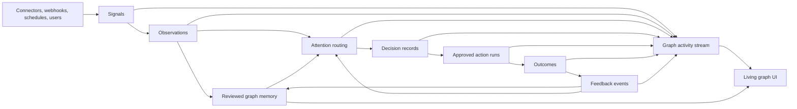

# Digital Nervous System Phase 25 Plan

> Historical plan: this records the Phase 25 design and includes intentionally conservative stub-era language. The
> Graphview 1.0 implementation replaces those external-action stubs with reviewed GitHub Issue, SMTP, and signed
> webhook adapters; current evidence lives in `14-graphview-1.0-upgrade-ledger.md`.

## Purpose

Phase 25 completes the product plan beyond the living graph UI. Phase 24 makes the graph feel alive and makes agent
work visible inside the graph. Phase 25 makes Graphview behave like a digital nervous system end to end.

The goal is to move from a trusted knowledge graph workbench to an operating loop that can sense change, interpret it,
route attention, support decisions, trigger approved actions, observe outcomes, and update durable graph memory.

## North Star

Graphview should become the system that answers:

- What changed?
- Why does it matter?
- What does it affect?
- Who owns it?
- What should happen next?
- What evidence supports that?
- What action was taken?
- Did the action work?
- What should the graph learn from the outcome?

The full digital nervous system loop is:

```text
sense -> interpret -> remember -> prioritize -> decide -> act -> observe outcome -> learn
```

The graph remains the center of the user interface. Phase 25 adds the operating model and data contracts that make that
living graph actionable.

## Relationship To Phase 24

| Phase | Primary job | Outcome |
| --- | --- | --- |
| Phase 24 | Make graph activity visible and alive. | Users can see hover, focus, evidence, agent scans, proposals, and review transitions in the graph. |
| Phase 25 | Make the graph an operational nervous system. | Users can route signals, decide, act, observe outcomes, and feed learning back into the graph. |

Phase 25 should reuse the Phase 24 visual activity model. Signals, alerts, actions, outcomes, and feedback should become
visible graph states and graph events rather than separate dashboard-only records.

## What Exists Today

| Capability | Current state | Gap for Phase 25 |
| --- | --- | --- |
| Source ingestion | Sources, chunks, ingestion runs, connector sync runs. | Needs continuous sensing, event ingestion, and source freshness semantics. |
| Graph memory | Reviewed nodes, edges, provenance, lineage, embeddings. | Needs temporal state, confidence changes, and outcome-linked learning. |
| Review queue | Proposal review, ready/blocked state, review activity, source coverage. | Needs broader attention routing beyond proposal approval. |
| AI agents | Planning, graph Q&A, scoped research, action proposals. | Needs operational decision support, action execution, outcome tracking, and feedback. |
| Connectors | Upload, URL, repository, Google Workspace, Notion. | Needs production connector lifecycle, webhooks, scheduling, deletion/staleness, retry, and sync health. |
| Operations | Roles, metrics, backup/restore, provider registry. | Needs signal/action observability, ownership, SLA, escalation, audit, and replay. |
| Living graph plan | Phase 24 visual activity roadmap. | Needs backend activity streams and operational event types. |

## Remaining Goals Covered By Phase 25

Phase 25 covers the remaining goals needed for a true digital nervous system:

- Continuous sensing through webhooks, scheduled syncs, event ingestion, and manual signal creation.
- First-class signal, observation, alert, action, outcome, owner, policy, and feedback objects.
- Attention routing for review, stale knowledge, conflicts, anomalies, connector issues, planning actions, and
  operational follow-up.
- Ownership and escalation for graph areas, sources, topics, entities, and actions.
- Action execution through approved side effects such as notifications, ticket creation, connector sync, source update,
  review decision, graph proposal, or external workflow trigger.
- Outcome tracking so Graphview knows whether actions resolved the underlying signal.
- Feedback loops that update source freshness, graph confidence, attention policy, and future prioritization.
- Temporal memory for state changes, recurring signals, stale facts, decisions, and action history.
- Activity persistence and streaming so the living graph can replay and show live system behavior.
- Production-grade connector lifecycle for auth refresh, pagination, rate limits, retries, deletion, stale detection, and
  sync observability.

## Phase 25 Scope

### In Scope

- Signal and observation ingestion.
- Attention inbox and routing rules.
- Ownership, assignment, escalation, and SLA metadata.
- Action proposals, approval, execution, and outcome records.
- Feedback events that update graph memory or attention ranking.
- Temporal state and freshness policy.
- Activity stream and replay for graph events.
- Connector maturity required for reliable sensing.
- API, repository, schema, worker, web, and docs contracts for the full loop.

### Out Of Scope

- Public multi-tenant SaaS.
- Marketplace connector ecosystem.
- Fully autonomous graph mutation without review or policy gates.
- General-purpose workflow automation platform.
- Real-time multi-user editing.
- Replacing specialized ticketing, incident, or notification systems. Graphview may integrate with them but should not
  become all of them.

## Core Domain Model

Phase 25 adds operating objects around the existing graph model.

| Entity | Purpose |
| --- | --- |
| `Signal` | A raw input that indicates something changed or needs attention. |
| `Observation` | A normalized interpretation of one or more signals against graph context. |
| `Alert` | A prioritized attention item created from observations, policy, or system health. |
| `AttentionItem` | User-facing queue item that can represent proposal review, alert, conflict, stale source, action, or outcome follow-up. |
| `Owner` | A person, team, service account, or group responsible for a graph area, source, topic, entity, or action. |
| `RoutingPolicy` | Rules for severity, ownership, SLA, escalation, review gate, and suggested action. |
| `DecisionRecord` | A durable human or agent-assisted decision with rationale and evidence. |
| `ActionProposal` | A proposed side effect that requires review, approval, or policy evaluation. |
| `ActionRun` | A concrete execution of an approved action. |
| `Outcome` | The observed result of an action, including success, failure, partial success, or unresolved state. |
| `FeedbackEvent` | A learning event that updates confidence, freshness, priority, ownership, policy, or graph memory. |
| `GraphActivityEvent` | A renderable and replayable event consumed by the living graph UI. |

## Data Model Plan

Suggested tables:

| Table | Purpose | Notes |
| --- | --- | --- |
| `signals` | Raw sensed inputs. | Stores source kind, payload summary, checksum, received timestamp, actor/system source, trace ID. |
| `observations` | Normalized facts from signals. | Links signals to graph nodes, edges, sources, chunks, proposals, or topics. |
| `alerts` | Prioritized conditions that need attention. | Stores severity, status, reason, policy, owner, due time, and graph links. |
| `attention_items` | Unified work queue projection. | May be durable if assignment/SLA/status must persist; otherwise computed with status records. |
| `owners` | Ownership records. | Person/team/service ownership for graph scopes and action routing. |
| `routing_policies` | Routing and escalation rules. | JSON policy for severity, matching, approval, SLA, and suggested actions. |
| `decision_records` | Human or assisted decisions. | Broader than review decisions; can link to alerts, action proposals, graph items, and evidence. |
| `action_proposals` | Review-gated side effects. | Can extend existing `agent_action_proposals` or become a general action proposal table. |
| `action_runs` | Executed approved actions. | Stores executor, integration target, status, error, timestamps, and external ID. |
| `outcomes` | Result of actions. | Stores measured or user-confirmed outcome and graph/context links. |
| `feedback_events` | Learning and memory updates. | Stores confidence/freshness/priority/policy updates and rationale. |
| `graph_activity_events` | Replayable UI/system activity. | Derived initially; durable once streaming/replay is required. |

Suggested schema invariants:

- Every signal belongs to one project.
- Signals must preserve source identity, checksum, timestamp, and trace ID.
- Observations must link to at least one signal or source.
- Alerts must link to evidence or explain why evidence is unavailable.
- Action runs require approved action proposals or an explicit policy allow rule.
- Outcomes must link to an action run, alert, decision, or observation.
- Feedback events must be auditable and reversible where they change graph confidence or policy behavior.
- No external side effect may run without permission, policy, trace ID, and durable status.
- Sensitive connector or provider payloads must not be returned from read endpoints.

## Signal Taxonomy

| Signal kind | Examples | Typical routing |
| --- | --- | --- |
| `source_changed` | Connector detected changed document, new file, repository diff. | Source owner or graph builder. |
| `source_stale` | Document older than freshness policy, stale source marker. | Source owner or reviewer. |
| `proposal_ready` | New node/edge proposal ready. | Reviewer. |
| `proposal_blocked` | Relationship missing reviewed endpoints. | Reviewer or graph builder. |
| `conflict_detected` | Contradictory facts, duplicate entity, competing source claims. | Reviewer and owner. |
| `anomaly_detected` | Metric movement, unusual graph topology, unexpected sync volume. | Owner or maintainer. |
| `connector_issue` | Auth failure, rate limit, deleted remote item, sync error. | Maintainer or connector owner. |
| `agent_action_pending` | AI requests side effect approval. | Reviewer or admin depending on action. |
| `decision_due` | Review cycle, policy due date, recurring check. | Responsible owner. |
| `outcome_due` | Action requires follow-up result. | Action owner. |
| `policy_violation` | Missing provenance, low confidence auto-commit attempt, forbidden external transfer. | Maintainer/security owner. |

## Attention Model

Phase 25 should replace the narrow review queue with a broader Attention workspace while preserving proposal review as
one attention type.

Attention item fields:

- ID and kind.
- Title and summary.
- Severity: `info`, `low`, `medium`, `high`, `critical`.
- Status: `open`, `assigned`, `waiting_for_review`, `waiting_for_action`, `waiting_for_outcome`, `resolved`,
  `dismissed`, `blocked`.
- Owner and assignee.
- Due time and SLA status.
- Evidence links.
- Related graph IDs.
- Suggested actions.
- Blocking reasons.
- Source, signal, observation, alert, proposal, decision, action, and outcome links.

Attention ranking inputs:

- Severity.
- Confidence.
- Graph centrality or blast radius.
- Freshness age.
- Number of affected graph items.
- Owner priority.
- User lens.
- Whether the item is blocking another action.
- Whether an SLA is at risk.
- Whether the issue repeats across signals.

## Ownership And Routing

Ownership is required for a nervous system because sensing without accountability creates noise.

Ownership scopes:

- Graph project.
- Graph lens.
- Topic.
- Source or connector target.
- Node kind.
- Specific content node or semantic edge.
- Routing policy.
- Action type.
- Provider or connector integration.

Routing behavior:

1. Match signal or observation to graph scope.
2. Resolve owner by most specific match.
3. Apply routing policy for severity and SLA.
4. Create or update alert and attention item.
5. Notify or assign only when policy allows.
6. Escalate when overdue or blocked.
7. Record every routing decision.

## Decision And Action Model

Phase 25 should distinguish between deciding and acting.

Decision examples:

- Accept the suggested relationship.
- Reject a stale source warning.
- Confirm that two entities are duplicates.
- Approve a connector resync.
- Approve a notification to an owner.
- Approve a ticket creation.
- Approve an external workflow trigger.

Action examples:

- Create graph proposal.
- Apply review decision.
- Start connector sync.
- Mark source stale or refreshed.
- Create external ticket.
- Send notification.
- Trigger internal workflow.
- Request owner confirmation.
- Create follow-up research task.

Action lifecycle:

```text
suggested -> proposed -> approved -> queued -> running -> succeeded|failed|partial -> outcome_due -> resolved|reopened
```

Action safety requirements:

- Every action type declares whether it mutates Graphview, calls an external system, or transfers private content.
- External actions require explicit approval unless a routing policy allows them.
- Action payloads must be redacted in read endpoints.
- Action runs must record external IDs, trace IDs, actor, provider or connector, status, and error codes.
- Failed actions must create or update attention items.

## Outcome And Feedback Model

The product becomes a nervous system only when it learns from outcomes.

Outcome examples:

- A ticket was created and later closed.
- A source owner confirmed a stale document is still valid.
- A reviewer rejected an AI proposal as duplicate.
- A connector sync fixed stale source coverage.
- A policy escalation was dismissed as noise.
- A conflict was resolved by accepting one source and marking another outdated.

Feedback effects:

- Increase or decrease source confidence.
- Mark source refreshed or stale.
- Update node or edge confidence metadata.
- Adjust attention ranking for repeated false positives.
- Update routing policy thresholds.
- Create new graph proposals.
- Create review-cycle reminders.
- Record policy exceptions.

Feedback safety:

- Feedback that changes graph memory must be review-gated or policy-gated.
- Feedback should preserve rationale and evidence.
- Automated feedback should never erase provenance.

## Temporal Memory

Phase 25 adds time as a first-class dimension.

Needed capabilities:

- State history for signals, alerts, actions, and outcomes.
- Source freshness and stale markers.
- Review cycles and recurring decision due dates.
- Timeline of graph changes.
- Snapshot comparison for graph state.
- Repeated signal detection.
- Confidence decay over time for stale claims.
- Outcome windows for actions.

Temporal views:

- What changed today?
- What became stale this week?
- What actions are waiting for outcome?
- What high-severity attention items are overdue?
- What graph areas changed most?
- What decisions were reversed or reopened?

## API Plan

Read endpoints:

- `GET /signals`
- `GET /signals/{signal_id}`
- `GET /observations`
- `GET /alerts`
- `GET /attention`
- `GET /owners`
- `GET /routing-policies`
- `GET /decision-records`
- `GET /action-proposals`
- `GET /action-runs`
- `GET /outcomes`
- `GET /feedback-events`
- `GET /graph/activity`
- `GET /graph/activity/stream`

Write endpoints:

- `POST /signals`
- `POST /observations`
- `POST /alerts/{alert_id}/assign`
- `POST /attention/{attention_item_id}/transition`
- `POST /owners`
- `PATCH /owners/{owner_id}`
- `POST /routing-policies`
- `PATCH /routing-policies/{policy_id}`
- `POST /decision-records`
- `POST /action-proposals`
- `POST /action-proposals/{action_proposal_id}/approve`
- `POST /action-proposals/{action_proposal_id}/reject`
- `POST /action-runs`
- `POST /action-runs/{action_run_id}/outcome`
- `POST /feedback-events`

Streaming:

- Start with polling from durable endpoints.
- Add server-sent events for `GET /graph/activity/stream` once graph activity event semantics are stable.
- Keep stream payloads redacted and bounded.

## Worker And Agent Plan

New worker stages:

| Stage | Purpose |
| --- | --- |
| Signal ingest | Accept webhook, scheduled sync, manual, or API-created signal. |
| Signal normalize | Convert raw payload into stable normalized signal fields. |
| Observation extract | Interpret signal against graph, source chunks, proposals, and lineage. |
| Attention route | Apply routing policies, ownership, severity, and SLA. |
| Action propose | Create safe action proposals from observations or decisions. |
| Action execute | Run approved side effects through connectors or internal APIs. |
| Outcome collect | Poll, receive, or record action outcomes. |
| Feedback apply | Create feedback events and review-gated graph/policy updates. |
| Activity publish | Emit graph activity events for UI visualization and replay. |

Agent responsibilities:

- Summarize signals using graph context.
- Explain why an alert matters.
- Suggest owners and actions with citations.
- Identify missing evidence.
- Draft action proposals.
- Summarize outcomes.
- Suggest feedback updates.

Agent boundaries:

- Agents may suggest actions, but external side effects require approval or explicit policy.
- Agents may create graph proposals, but reviewed graph changes still use proposal/review paths.
- Agents must include citations for signal interpretation and suggested actions.

## Connector Maturity Plan

Phase 25 requires connectors to behave like sensing organs.

Connector requirements:

- Scheduled syncs.
- Webhook intake where supported.
- Auth refresh and token expiry handling.
- Pagination and rate-limit handling.
- Remote deletion detection.
- Remote stale detection.
- Idempotent remote identity and checksum handling.
- Sync diff summaries.
- Sync health and error codes.
- Owner assignment for connector targets.
- Signal creation for new, changed, deleted, stale, failed, or anomalous sync events.

Connector signal examples:

- New remote document creates `source_changed`.
- Remote deletion creates `source_stale` or `source_removed`.
- Auth failure creates `connector_issue`.
- Large unexpected diff creates `anomaly_detected`.
- Changed repository file creates `source_changed` and can route to engineering owners.

## Web Experience Plan

Phase 25 should add an Attention layer while keeping the graph central.

Required surfaces:

- Graph-centered Attention mode.
- Signal and alert overlays in the graph.
- Owner and routing badges on nodes, sources, and attention items.
- Action proposal cards linked to graph objects.
- Outcome follow-up cards.
- Temporal activity timeline.
- Policy and owner management screens for admins.
- Graph activity replay controls.
- Filter controls by severity, owner, status, signal kind, action kind, graph lens, and time window.

Graph visual states added by Phase 25:

- Sensed signal.
- Routed alert.
- Assigned owner.
- SLA at risk.
- Action proposed.
- Action running.
- Outcome waiting.
- Outcome succeeded.
- Outcome failed.
- Feedback applied.
- Reopened.

User journey: signal to action:

1. A connector detects a changed source and creates a signal.
2. The graph shows an incoming signal near the affected source or node.
3. The system creates an observation and links it to graph context.
4. A routing policy creates an alert and assigns an owner.
5. The Attention layer ranks the item.
6. The user opens the graph-linked attention detail.
7. The agent explains the issue with evidence and suggests an action.
8. The user approves the action.
9. The action run executes.
10. The outcome is captured.
11. Feedback updates source freshness, confidence, or future routing.
12. The graph activity timeline can replay the loop.

## Operations And Governance Plan

New operational requirements:

- Signal and action metrics.
- Attention backlog metrics.
- SLA and escalation metrics.
- Connector sensing health.
- Action run success/failure rate.
- Outcome resolution time.
- Feedback application rate.
- Policy exceptions.
- Stream health and replay health.

Security requirements:

- External action allowlist.
- Action payload redaction.
- Provider and connector secret redaction.
- Per-action permission checks.
- Audit records for decisions, approvals, executions, outcomes, and feedback.
- Data transfer policy per provider and action type.
- Admin-only policy mutation.

Backup/restore requirements:

- Preserve signals, observations, alerts, owners, routing policies, decisions, actions, outcomes, feedback, and graph
  activity events.
- Preserve original IDs, timestamps, trace IDs, and external IDs.
- Restore should not re-execute external actions.
- Replay after restore should use stored activity events, not re-run side effects.

## Implementation Tracks

### Track 1: Phase 25 Contracts

Goal: Define the new operating-loop contracts.

Work:

- Add shared TypeScript types for signals, observations, alerts, attention items, owners, policies, action runs,
  outcomes, feedback events, and graph activity events.
- Add Pydantic schemas.
- Add OpenAPI endpoints.
- Update data schema docs.
- Add contract tests.

Acceptance criteria:

- Public contracts distinguish source/proposal/review records from signal/action/outcome records.
- Action side effects declare safety metadata.
- Sensitive payload fields are redacted from read responses.

### Track 2: Persistence And Repository

Goal: Store the nervous-system loop durably.

Work:

- Add migrations for Phase 25 tables.
- Add repository CRUD and transition methods.
- Add status transition guards.
- Add backup/restore support.
- Add export/import support where appropriate.
- Add tests for invariants and status transitions.

Acceptance criteria:

- Signals can become observations, alerts, action proposals, action runs, outcomes, and feedback events.
- Invalid transitions are rejected.
- Backup/restore preserves Phase 25 records without re-executing actions.

### Track 3: Signal Ingestion

Goal: Sense changes continuously.

Work:

- Add manual/API signal creation.
- Add connector sync signal generation.
- Add scheduled sync signal generation.
- Add webhook endpoint shape for future connectors.
- Add signal normalization and checksum/idempotency.

Acceptance criteria:

- Duplicate signals are suppressed or linked.
- Connector issues produce attention items.
- Source changes create graph-linked signals.

### Track 4: Attention Routing

Goal: Turn signals into prioritized, owned work.

Work:

- Add owner records and routing policies.
- Add attention item creation and ranking.
- Add SLA and escalation fields.
- Add status transitions and assignment.
- Add attention API filters.

Acceptance criteria:

- Signals can route to owners by graph scope.
- Attention items expose severity, owner, status, blockers, and evidence.
- Overdue or blocked items are visible and queryable.

### Track 5: Decision And Action Execution

Goal: Safely move from decision to side effect.

Work:

- Generalize action proposals beyond agent-only proposals.
- Add action approval and rejection.
- Add action run execution boundary.
- Add built-in actions: create proposal, start connector sync, mark source stale/refreshed, create research task,
  create notification stub, create external ticket stub.
- Add per-action permission checks and payload redaction.

Acceptance criteria:

- No external side effect runs without approval or policy allow.
- Failed action runs create attention updates.
- Action run status and outcome state are durable.

### Track 6: Outcome And Feedback

Goal: Close the loop.

Work:

- Add outcome records and outcome due states.
- Add feedback event creation.
- Add graph confidence/freshness update proposals from feedback.
- Add feedback-to-routing policy suggestions.
- Add tests that outcomes can resolve or reopen attention items.

Acceptance criteria:

- Action outcomes can resolve, partially resolve, fail, or reopen work.
- Feedback can propose graph memory updates without bypassing review.
- False-positive feedback can lower future attention priority through policy proposals.

### Track 7: Activity Stream And Replay

Goal: Feed Phase 24 living graph visuals with durable activity.

Work:

- Derive graph activity events from Phase 25 records.
- Add `GET /graph/activity`.
- Add replay ordering and bounded pagination.
- Add optional server-sent event stream.
- Add UI consumption contract for Phase 24 graph overlays.

Acceptance criteria:

- The graph can show recent signal, attention, action, outcome, and feedback events.
- Activity replay does not trigger side effects.
- Stream payloads are bounded and redacted.

### Track 8: Web Attention Workspace

Goal: Add the operational UI while keeping graph center.

Work:

- Add Attention mode in the graph workspace.
- Add signal and alert graph overlays.
- Add attention detail cards with evidence, owner, suggested action, and outcome status.
- Add owner and routing policy management for admins.
- Add action approval and outcome capture UI.
- Add activity timeline and replay controls.

Acceptance criteria:

- Users can go from graph signal to decision to action to outcome in one graph-centered flow.
- Admins can manage owners and routing policies.
- Reviewers can distinguish proposal review from broader operational attention.

### Track 9: Connector Production Hardening

Goal: Make connectors reliable sensing inputs.

Work:

- Add scheduled syncs and retry policy.
- Add auth refresh and token status.
- Add deletion and stale detection.
- Add sync diff summaries.
- Add connector health attention signals.
- Add rate-limit and pagination handling.

Acceptance criteria:

- Connector problems create actionable attention items.
- Deleted or changed remote items produce graph-linked signals.
- Sync retries are idempotent and observable.

### Track 10: QA, Security, And Release Gates

Goal: Ship Phase 25 without making side effects unsafe.

Work:

- Add tests for permission checks and action safety.
- Add tests for routing policy and status transitions.
- Add tests for backup/restore.
- Add docs for action data-transfer policy.
- Add release readiness checks for Phase 25 docs, endpoints, and backup coverage.
- Add UI smoke tests for attention, action, outcome, and graph activity flows.

Acceptance criteria:

- Operator-only and review-gated actions remain protected.
- Secrets and payloads are redacted.
- Backup/restore covers all Phase 25 records.
- Release checks fail if Phase 25 docs or contracts drift.

## Suggested Delivery Slices

### Phase 25A: Contracts And Persistence

- Add contracts, schemas, migrations, and repository support.
- Add backup/restore support.
- No external side effects yet.

### Phase 25B: Signals And Attention

- Add signal creation, connector-generated signals, observations, alerts, attention items, owners, and routing policies.
- Add graph-centered Attention mode.

### Phase 25C: Decisions And Action Proposals

- Add decision records, generalized action proposals, approval/rejection, and safe built-in internal actions.
- Keep external action execution stubbed or disabled by default.

### Phase 25D: Action Runs And Outcomes

- Add action execution boundary, action runs, outcome capture, outcome due states, and failure handling.
- Add notification/ticket/workflow stubs behind explicit configuration.

### Phase 25E: Feedback And Learning

- Add feedback events, confidence/freshness update proposals, policy suggestions, false-positive handling, and reopened
  attention flows.

### Phase 25F: Activity Streaming And Replay

- Add graph activity endpoints, replay, optional stream, and integration with the Phase 24 living graph visuals.

### Phase 25G: Connector Sensing Maturity

- Add scheduled syncs, webhook shapes, retry policy, deletion/stale detection, pagination, auth refresh, and connector
  health signals.

### Phase 25H: Release Hardening

- Add release checks, full docs, security review, backup validation, UI smoke tests, and operational runbooks.

## User Journeys

### Journey 1: Detect A Changed Source

1. Connector sync or webhook reports changed remote content.
2. Graphview creates a `source_changed` signal.
3. The signal normalizes into an observation linked to the source and affected graph nodes.
4. Routing policy creates a medium-severity attention item for the source owner.
5. The graph shows the affected source and nodes as changed.
6. The owner reviews evidence and approves ingestion or follow-up research.
7. Proposals are generated and reviewed.
8. Outcome marks the source refreshed.
9. Feedback updates freshness and source confidence.

### Journey 2: Resolve A Conflict

1. Agent or deterministic logic detects contradictory claims.
2. Graphview creates a `conflict_detected` signal and observation.
3. Attention routes to the relevant graph owner.
4. The graph highlights both claims, sources, and affected edges.
5. The user asks the agent for a cited explanation.
6. The user records a decision and chooses an action.
7. The action creates proposals to mark one claim outdated or update an edge.
8. Review accepts or rejects the proposals.
9. Outcome resolves the conflict or reopens it.

### Journey 3: Recover From Connector Failure

1. Connector auth expires or sync fails.
2. Graphview creates a `connector_issue` signal.
3. Attention routes to the maintainer with severity based on affected source count.
4. The graph shows affected source areas as stale or unsynced.
5. Maintainer refreshes credentials or retries sync.
6. Action run records success or failure.
7. Outcome updates connector health.
8. Feedback adjusts retry or escalation policy if needed.

### Journey 4: Follow Up On An Action

1. A reviewer approves an action to create an external ticket.
2. Action run creates the ticket and stores the external ID.
3. Outcome is marked due.
4. Graphview polls or receives status.
5. Ticket closure creates an outcome.
6. Outcome resolves the attention item.
7. Feedback updates confidence, policy, or graph memory through reviewable proposals.

### Journey 5: Watch The Nervous System Replay

1. User opens graph activity replay for a graph area.
2. The graph replays signal creation, observation, routing, decision, action, outcome, and feedback.
3. User can pause on any event and inspect evidence, actor, trace ID, and graph links.
4. User can export the activity trail for audit.

## Digital Nervous System Diagram



## Success Metrics

| Metric | What it proves |
| --- | --- |
| Signal-to-attention conversion rate | Sensing is producing actionable work. |
| Attention resolution time | Owners can resolve important work quickly. |
| Overdue attention count | Routing, SLA, or ownership gaps are visible. |
| Action approval rate | Suggested actions are useful and trusted. |
| Action success rate | Approved actions execute reliably. |
| Outcome completion rate | The loop closes instead of stopping at action. |
| Feedback application rate | The system is learning from outcomes. |
| Reopened attention rate | The system catches incomplete resolutions. |
| Connector health score | Sensing inputs are reliable. |
| False-positive dismissal rate | Policies and agents need tuning. |
| Graph confidence/freshness trend | Memory quality is improving over time. |

## Risks And Guardrails

| Risk | Impact | Guardrail |
| --- | --- | --- |
| Too many signals create noise. | Users ignore attention items. | Ranking, ownership, dedupe, severity policy, false-positive feedback. |
| Actions run without review. | Unsafe side effects. | Approval gates, policy allowlist, per-action permissions, audit. |
| Feedback mutates graph trust silently. | Provenance and review model break. | Review-gated feedback updates and durable rationale. |
| Connectors leak secrets. | Security incident. | Redacted read models, external secret stores, log scrubbing. |
| Activity stream exposes private payloads. | Sensitive content leak. | Bounded summaries and redacted event payloads. |
| Restore replays side effects. | Duplicate tickets, notifications, or syncs. | Restore never re-executes action runs. |
| Ownership is too vague. | Attention items remain unresolved. | Specificity rules and escalation policies. |
| External systems become hard dependencies. | Reliability and scope creep. | Stubs first, explicit connector/action boundaries, graceful failure. |

## Documentation Updates Required During Implementation

Implementation of Phase 25 must update:

- `09-data-schema.md` with Phase 25 tables and invariants.
- `02-architecture.md` with new API and service boundaries.
- `06-operations.md` with signal/action metrics, backup/restore, and security notes.
- `07-agent-workflows.md` with multi-agent implementation tracks.
- `03-security.md` with action approval, redaction, provider transfer, and audit rules.
- `05-testing.md` with status transition, backup/restore, security, and UI smoke coverage.
- `README.md` and `CHANGELOG.md` when Phase 25 ships.

## Definition Of Done

Phase 25 is complete when:

- Graphview can ingest signals from API, connector sync, schedules, and manual user creation.
- Signals can become observations linked to graph context.
- Observations can become prioritized, owned attention items.
- Attention items support severity, owner, status, SLA, blockers, evidence, and graph links.
- Users can record broader decisions beyond proposal review.
- Approved action proposals can execute safe built-in action runs.
- Action outcomes can be captured, resolved, failed, partially resolved, or reopened.
- Feedback events can propose graph memory, freshness, confidence, or policy updates.
- Graph activity events can replay the full loop in the living graph UI.
- Connector sensing handles scheduled syncs, retries, stale/deleted remote items, and health signals.
- Backup/restore preserves every Phase 25 record without re-running side effects.
- Security gates prevent unauthorized external actions and redact sensitive payloads.
- Docs, contracts, tests, release checks, and operational runbooks cover the complete loop.
